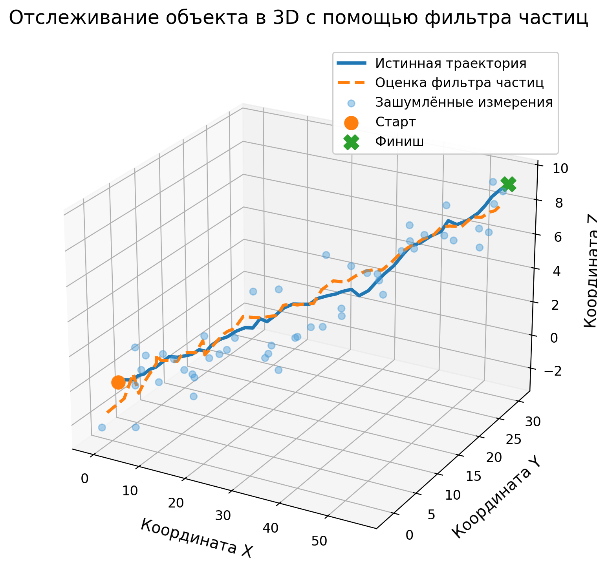
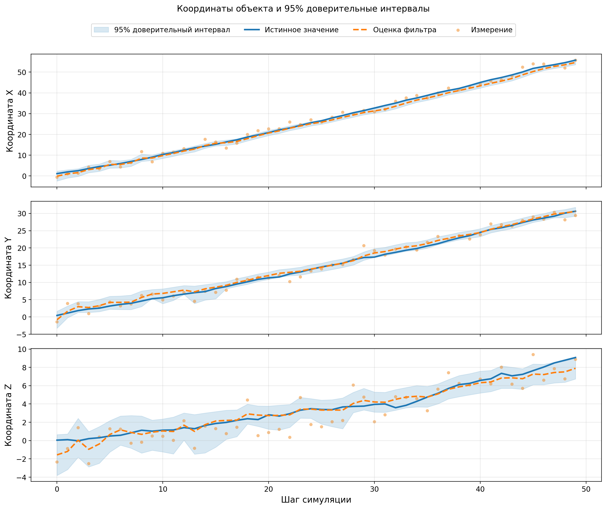
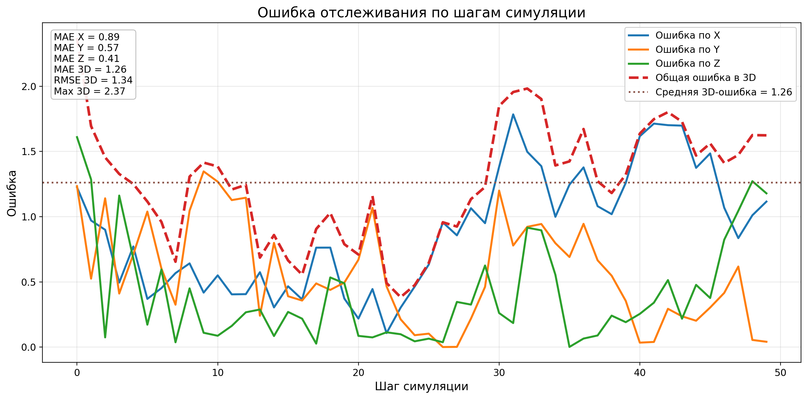
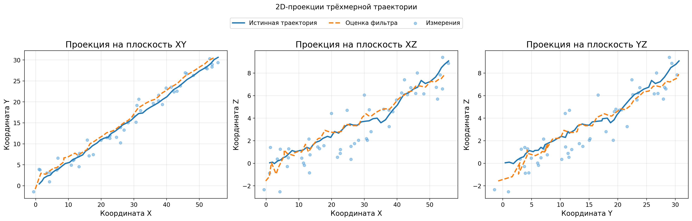

# 3D Particle Filter на C

Учебный проект на языке C, реализующий трёхмерный фильтр частиц для отслеживания положения движущегося объекта по зашумлённым измерениям.

Программа моделирует движение объекта в 3D-пространстве, создаёт шумные измерения координат, применяет Particle Filter, оценивает положение объекта, считает 95% доверительный интервал и сохраняет результат в `output.csv`.

Дополнительно в проекте есть Python-скрипт для построения графиков и сохранения метрик качества отслеживания.

---

## Быстрый запуск

Собрать проект:

```bash
make
```

Запустить симуляцию и создать `output.csv`:

```bash
make run
```

Установить зависимости для построения графиков:

```bash
pip install -r requirements.txt
```

Построить графики и сохранить метрики:

```bash
make plot
```

Запустить smoke test:

```bash
make test
```

---

## Требования для запуска

Для основной C-части проекта нужны:

- `gcc`;
- `make`;
- стандартная математическая библиотека C, подключаемая через `-lm`.

На Windows удобно использовать MSYS2/MinGW или другую среду, где доступны `gcc` и `make`.

Для визуализации нужны:

- Python 3;
- библиотека `matplotlib`.

Python используется только для построения графиков по готовому `output.csv`. Основная реализация фильтра частиц написана на C.

---

## Цель проекта

Цель проекта - реализовать с нуля простой трёхмерный Particle Filter на языке C.

Проект демонстрирует:

- моделирование движения объекта в 3D-пространстве;
- работу с зашумлёнными измерениями;
- базовую идею байесовской фильтрации;
- использование набора частиц для оценки скрытого состояния;
- prediction с экспоненциальным сглаживанием скорости;
- resampling частиц;
- расчёт 95% доверительного интервала;
- сохранение результатов в CSV;
- визуализацию результатов в Python.

---

## Краткое описание алгоритма

Фильтр частиц хранит не одну точку, а множество возможных состояний объекта.

Каждая частица - это одна гипотеза о том, где объект может находиться и с какой скоростью он может двигаться.

На каждом шаге симуляции выполняются следующие действия:

1. Обновляется истинное положение объекта.
2. Создаётся зашумлённое измерение координат.
3. Все частицы делают prediction - предсказывают своё новое положение.
4. Частицы сравниваются с измерением.
5. Частицам назначаются веса.
6. Веса нормализуются.
7. Выполняется resampling.
8. Считается итоговая оценка положения.
9. Считается 95% доверительный интервал.
10. Результат записывается в `output.csv`.

---

## Структура проекта

```text
.
├── include/
│   ├── particle_filter.h
│   ├── random_utils.h
│   └── csv_writer.h
│
├── src/
│   ├── main.c
│   ├── particle_filter.c
│   ├── random_utils.c
│   └── csv_writer.c
│
├── tests/
│   └── test_main.c
│
├── scripts/
│   └── plot_results.py
│
├── plots/
│   ├── trajectory_3d.png
│   ├── coordinates_with_confidence_intervals.png
│   ├── tracking_error.png
│   ├── trajectory_projections.png
│   ├── metrics.txt
│   └── metrics.csv
│
├── Makefile
├── requirements.txt
├── .gitignore
└── README.md
```

---

## Основные файлы проекта

### `src/main.c`

Главный файл программы.

В нём находится основной цикл симуляции:

- задаются параметры модели;
- создаётся массив частиц;
- моделируется истинное движение объекта;
- генерируются зашумлённые измерения;
- вызываются функции Particle Filter;
- данные выводятся в консоль;
- результат записывается в `output.csv`.

### `include/particle_filter.h`

Заголовочный файл с описанием структуры `Particle` и объявлением основных функций фильтра частиц.

### `src/particle_filter.c`

Основная реализация Particle Filter.

В этом файле реализованы:

- `init_particles`;
- `predict`;
- `update_weights`;
- `normalize_weights`;
- `resample`;
- `estimate_position`;
- `compute_confidence_interval_95`.

### `include/random_utils.h` и `src/random_utils.c`

Модуль для генерации случайных чисел.

Он используется для:

- начального разброса частиц;
- процессного шума;
- шума измерений;
- случайного выбора частиц при resampling.

Для генерации нормального шума используется преобразование Бокса-Мюллера.

### `include/csv_writer.h` и `src/csv_writer.c`

Модуль для записи результатов в `output.csv`.

### `scripts/plot_results.py`

Python-скрипт для визуализации результатов.

Он читает `output.csv`, строит графики и сохраняет метрики качества отслеживания.

### `tests/test_main.c`

Простой smoke test.

Он проверяет, что основные функции проекта вызываются без ошибок.

---

## Структура частицы

В проекте используется структура:

```c
typedef struct {
    double x, y, z;
    double vx, vy, vz;
    double weight;
} Particle;
```

Каждая частица хранит:

- `x, y, z` - предполагаемое положение объекта;
- `vx, vy, vz` - предполагаемую скорость объекта;
- `weight` - вес частицы.

Вес показывает, насколько хорошо частица согласуется с текущим измерением.

---

## Основные параметры симуляции

В `main.c` используются следующие параметры:

```c
const int particle_count = 1000;
const int steps = 50;

const double dt = 1.0;
const double Q = 0.05;
const double R = 2.0;
const double alpha = 0.8;
```

Их смысл:

- `particle_count` - количество частиц;
- `steps` - количество шагов симуляции;
- `dt` - шаг времени;
- `Q` - уровень процессного шума;
- `R` - уровень шума измерений;
- `alpha` - коэффициент экспоненциального сглаживания скорости.

---

## Prediction через экспоненциальное сглаживание

В проекте prediction не реализован как простое прибавление скорости к координате.

Вместо этого скорость частицы обновляется через экспоненциальное сглаживание:

```text
v_new = alpha * v_old + (1 - alpha) * v_model
```

Где:

- `v_old` - старая скорость частицы;
- `v_model` - модельная скорость с добавленным шумом;
- `alpha` - коэффициент сглаживания.

После этого координата обновляется так:

```text
position = position + v_new * dt + noise
```

Такой подход делает движение более плавным и позволяет учитывать случайные изменения скорости.

При `alpha = 0.8` новая скорость на 80% зависит от старой скорости и на 20% от новой модельной скорости.

---

## Обновление весов частиц

После prediction каждая частица сравнивается с текущим измерением.

Для этого считается расстояние между положением частицы и измеренными координатами:

```text
distance_squared = (zx - x)^2 + (zy - y)^2 + (zz - z)^2
```

Затем вес частицы обновляется по формуле:

```text
weight = weight * exp(-0.5 * distance_squared / R)
```

Чем ближе частица к измерению, тем больше её вес.

Чем дальше частица от измерения, тем меньше её вес.

---

## Нормализация весов

После обновления веса могут иметь произвольную сумму.

Поэтому выполняется нормализация:

```text
weight_i = weight_i / sum(weights)
```

После нормализации сумма всех весов равна `1`.

Это нужно, чтобы веса можно было использовать как вероятности при resampling.

---

## Resampling

Resampling нужен, чтобы оставить больше частиц в областях, которые лучше согласуются с измерениями.

Частицы с большими весами могут быть скопированы несколько раз.

Частицы с маленькими весами могут исчезнуть.

После resampling все частицы снова получают одинаковый вес:

```text
1 / N
```

В проекте используется systematic resampling.

---

## Оценка положения объекта

Итоговая оценка положения считается как взвешенное среднее координат всех частиц:

```text
est_x = sum(x_i * weight_i)
est_y = sum(y_i * weight_i)
est_z = sum(z_i * weight_i)
```

После resampling веса у всех частиц одинаковые, поэтому оценка фактически становится средним положением текущего облака частиц.

---

## 95% доверительный интервал

95% доверительный интервал считается по распределению частиц.

Для каждой координаты отдельно:

1. Берутся все значения координаты у частиц.
2. Значения сортируются.
3. Берётся 2.5% квантиль.
4. Берётся 97.5% квантиль.

Так получаются интервалы:

```text
[x_low, x_high]
[y_low, y_high]
[z_low, z_high]
```

Эти интервалы показывают область, в которой, по распределению частиц, с высокой вероятностью находится объект.

---

## Формат `output.csv`

После запуска программы создаётся файл:

```text
output.csv
```

В нём каждая строка соответствует одному шагу симуляции.

Колонки файла:

```text
step,
true_x,true_y,true_z,
meas_x,meas_y,meas_z,
est_x,est_y,est_z,
x_low,x_high,
y_low,y_high,
z_low,z_high
```

Смысл колонок:

- `step` - номер шага симуляции;
- `true_x`, `true_y`, `true_z` - истинное положение объекта;
- `meas_x`, `meas_y`, `meas_z` - зашумлённое измерение;
- `est_x`, `est_y`, `est_z` - оценка фильтра частиц;
- `x_low`, `x_high` - границы 95% интервала по X;
- `y_low`, `y_high` - границы 95% интервала по Y;
- `z_low`, `z_high` - границы 95% интервала по Z.

---

## Сборка проекта

Проект собирается через `Makefile`.

Для сборки используется `gcc`.

Собрать проект:

```bash
make
```

После сборки появится исполняемый файл:

```text
particle_filter.exe
```

---

## Запуск программы

Запустить симуляцию:

```bash
make run
```

После запуска программа:

- выведет данные по шагам в консоль;
- создаст файл `output.csv`.

Пример консольного вывода:

```text
3D Particle Filter simulation
Particles: 1000, steps: 50

step 00 | true=(1.10, 0.43, 0.04) | meas=(-0.63, -1.44, -2.35) | est=(-0.12, -0.80, -1.57)
step 01 | true=(1.94, 1.12, 0.10) | meas=(1.03, 3.89, -0.88) | est=(0.97, 1.64, -1.19)
...
Result saved to output.csv
```

---

## Визуализация результатов

Для построения графиков используется Python-скрипт:

```text
scripts/plot_results.py
```

Перед построением графиков нужно сначала создать `output.csv`:

```bash
make run
```

Перед первым запуском визуализации нужно установить Python-зависимости:

```bash
pip install -r requirements.txt
```

Если используется Windows и команда `pip` не работает, можно попробовать:

```bash
py -m pip install -r requirements.txt
```

Затем можно построить графики:

```bash
make plot
```

После этого в папке `plots/` появятся графики и метрики.

---

## Графики

### 3D-траектория

Файл:

```text
plots/trajectory_3d.png
```

Показывает:

- истинную 3D-траекторию;
- зашумлённые измерения;
- оценку фильтра частиц;
- старт и финиш движения.



### Координаты и доверительные интервалы

Файл:

```text
plots/coordinates_with_confidence_intervals.png
```

Показывает изменение координат `x`, `y`, `z` по шагам симуляции.

На графике отображаются:

- истинные значения;
- измерения;
- оценка фильтра;
- 95% доверительный интервал.



### Ошибка отслеживания

Файл:

```text
plots/tracking_error.png
```

Показывает ошибку между истинным положением объекта и оценкой фильтра.

Отдельно отображаются:

- ошибка по X;
- ошибка по Y;
- ошибка по Z;
- общая ошибка в 3D.



### 2D-проекции траектории

Файл:

```text
plots/trajectory_projections.png
```

Показывает 3D-движение в виде трёх 2D-проекций:

- XY;
- XZ;
- YZ.



---

## Метрики качества

Скрипт визуализации сохраняет метрики качества отслеживания в файлы:

```text
plots/metrics.txt
plots/metrics.csv
```

Сохраняются следующие метрики:

- `MAE по X`;
- `MAE по Y`;
- `MAE по Z`;
- `MAE в 3D`;
- `RMSE по X`;
- `RMSE по Y`;
- `RMSE по Z`;
- `RMSE в 3D`;
- максимальная ошибка в 3D.

### MAE

MAE - средняя абсолютная ошибка.

Она показывает, насколько в среднем оценка фильтра отличается от истинного положения.

### RMSE

RMSE - среднеквадратичная ошибка.

Она сильнее реагирует на большие отклонения, чем MAE.

---

## Тестирование

В проекте есть простой smoke test.

Запустить тест:

```bash
make test
```

Ожидаемый вывод:

```text
[OK] smoke test passed
```

Smoke test проверяет, что основные функции фильтра вызываются без ошибок:

- инициализация частиц;
- prediction;
- обновление весов;
- нормализация весов;
- resampling;
- оценка положения;
- расчёт 95% доверительного интервала.

Этот тест не проверяет математическую точность алгоритма, но помогает убедиться, что основные модули проекта связаны корректно.

---

## Очистка файлов

Удалить исполняемые файлы и `output.csv`:

```bash
make clean
```

Удалить графики и метрики:

```bash
make clean-plots
```

Удалить всё сгенерированное:

```bash
make clean-all
```

---

## Основные команды

```bash
make
```

Собрать проект.

```bash
make run
```

Запустить симуляцию и создать `output.csv`.

```bash
make plot
```

Построить графики и сохранить метрики.

```bash
make test
```

Запустить smoke test.

```bash
make clean
```

Удалить `particle_filter.exe`, `test_main.exe` и `output.csv`.

```bash
make clean-plots
```

Удалить папку `plots/`.

```bash
make clean-all
```

Удалить все сгенерированные файлы.

---

## Особенности реализации

### Почему используется фиксированный seed

В `main.c` используется фиксированный seed:

```c
random_seed(42u);
```

Это нужно, чтобы результат симуляции можно было повторить при повторном запуске программы.

### Почему Python используется отдельно

Основная часть проекта реализована на языке C.

Python используется только для визуализации результата по файлу `output.csv`.

Это позволяет оставить C-программу простой и не подключать лишние сторонние библиотеки к основной реализации.

### Почему графики не строятся в C

C-программа отвечает за моделирование, фильтрацию и сохранение данных.

Графики строятся отдельно по CSV-файлу, потому что это проще, нагляднее и соответствует идее последующей визуализации результата в Python или Excel.

---

## Ограничения проекта

Проект является учебной реализацией.

В нём специально не используются сложные сторонние библиотеки и продвинутые методы оптимизации.

Ограничения текущей версии:

- модель движения упрощённая;
- параметры `Q`, `R`, `alpha` заданы вручную;
- resampling выполняется на каждом шаге;
- графики строятся отдельным Python-скриптом;
- smoke test не проверяет математическую точность фильтра.

---

## Что показывает результат

Если фильтр работает корректно, на графиках видно, что:

- зашумлённые измерения заметно отклоняются от истинной траектории;
- оценка фильтра идёт более плавно;
- оценка обычно ближе к истинной траектории, чем отдельные шумные измерения;
- доверительный интервал показывает область неопределённости;
- ошибка отслеживания меняется по шагам, но остаётся ограниченной.

---

## Итог

В результате реализована программа на C, которая:

- моделирует движение объекта в 3D-пространстве;
- генерирует зашумлённые измерения;
- применяет фильтр частиц;
- использует prediction с экспоненциальным сглаживанием скорости;
- считает оценку положения объекта;
- считает 95% доверительный интервал;
- сохраняет данные в `output.csv`;
- строит графики по результатам;
- сохраняет метрики качества отслеживания;
- собирается и запускается через `Makefile`.
